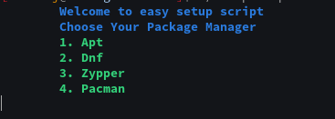
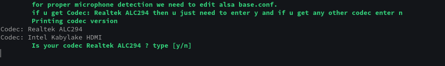
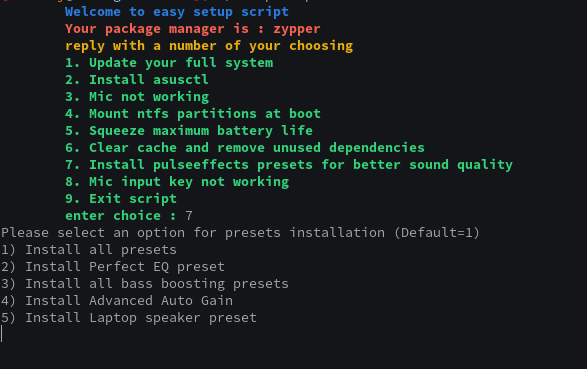

# Asus-ESS
Asus Easy Setup Script : Script to automate linux installs on Asus laptops **(Works on other laptops too)**
## Functions of the Script
I **distrohop** alot and I found myself doing all this stuff manually which eventually got tiresome. So I created this script to help other distrohoppers and new linux users. 


> It takes backups before changing stuff for easy recovery

> It works for other laptops too.

## Features of Script


## How to use
```bash
git clone https://github.com/drunckj/Asus-ESS
cd Asus-ESS/
./setupscript.sh
```
### On first use it will ask for your package manager

### Screenshots
#### Audio codec selection

#### Pulseeffects presets 

#### Note
If ntfs partition option breaks your pc u can easily add init=/bin/bash to the end of your grub from grub screen and boot into bash. 
If system is mount readonly, enter this in bash
```
mount -o remount,rw / --target /
```
And now undo fstab changes by deleting the last entered line in /etc/fstab or deleting the /etc/fstab file and renaming the /etc/fstab.bak to /etc/fstab.
