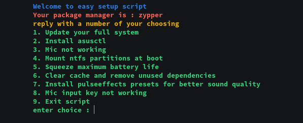

# Asus-ESS
Asus Easy Setup Script : Script to automate linux installs on Asus laptops **(Works on other laptops too)**
## Functions of the Script
I **distrohop** alot and I found myself doing all this stuff manually which eventually got tiresome. So I created this script to help other distrohoppers and new linux users. 


*It works for other laptops too.*

## Features of Script


## How to use
```bash
git clone https://github.com/drunckj/Asus-ESS
cd Asus-ESS/
./setupscript.sh
```
